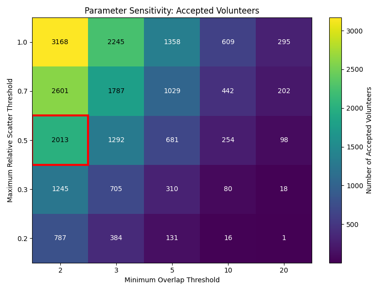
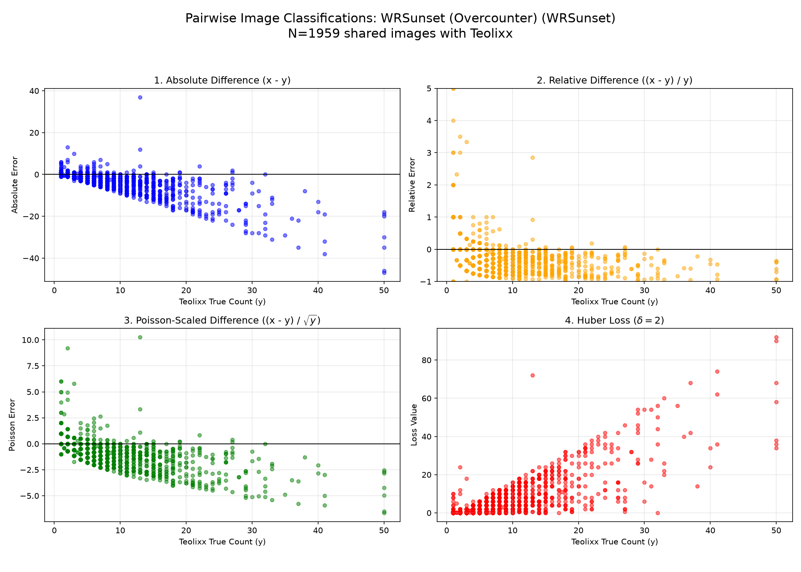
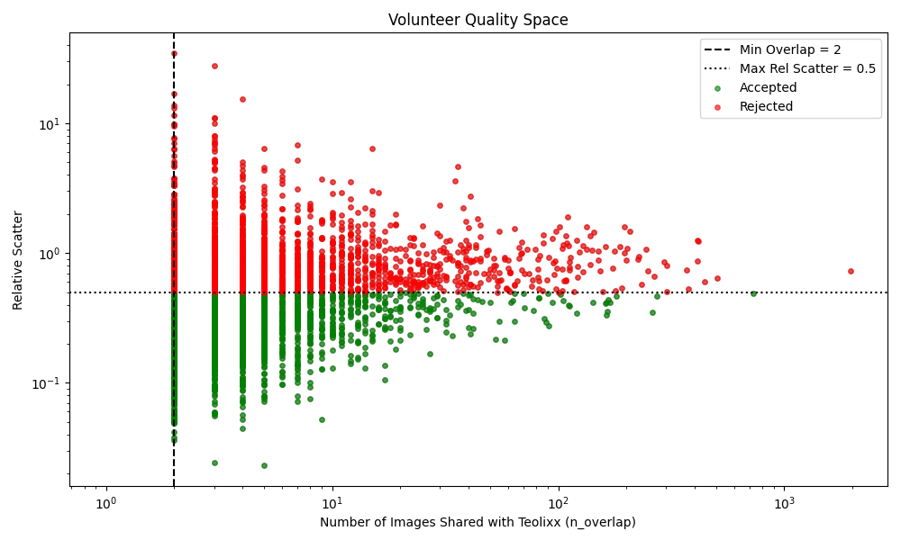
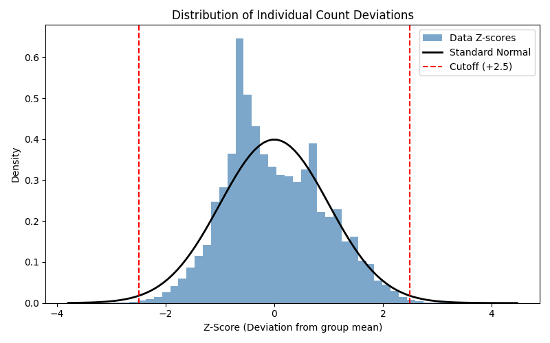
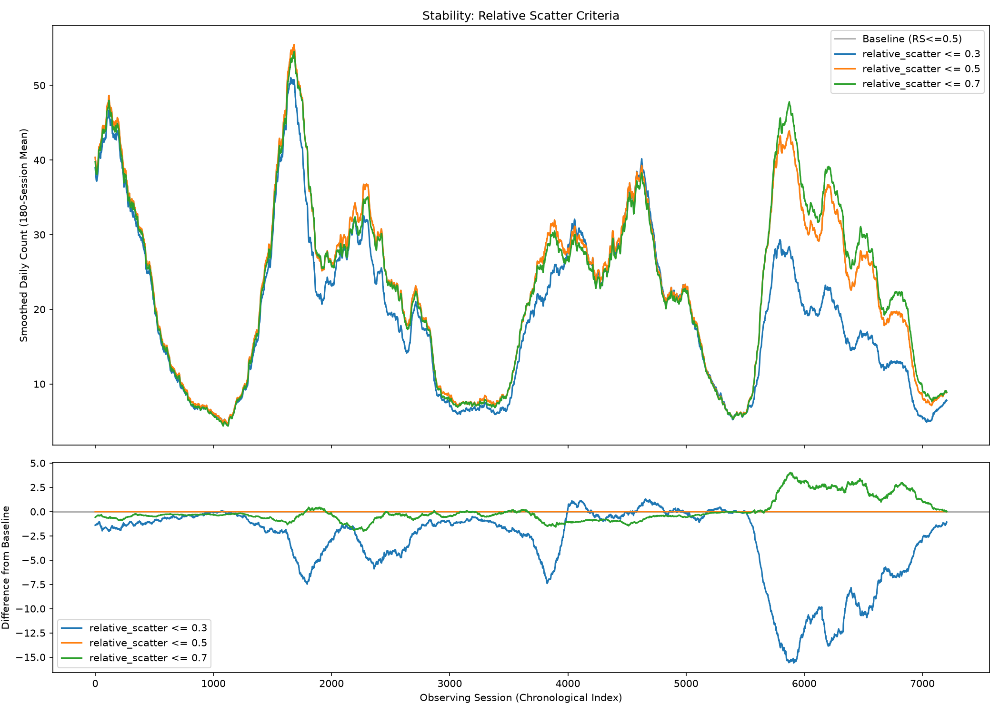
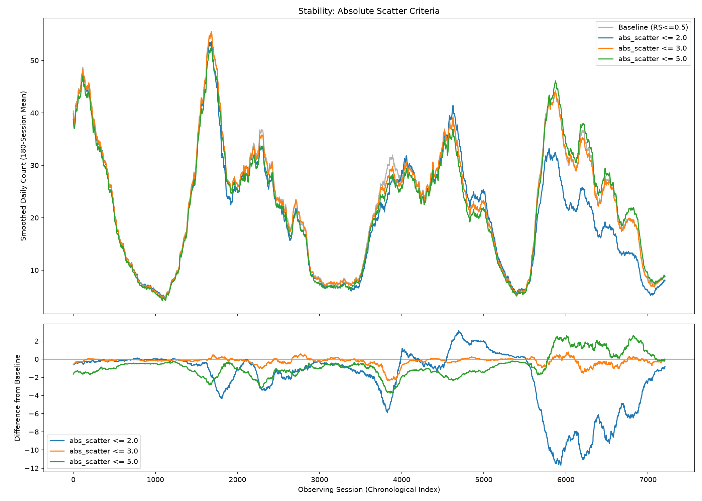
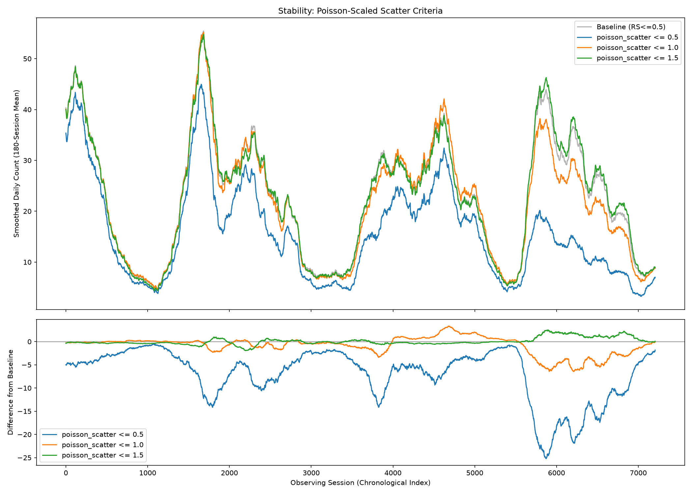
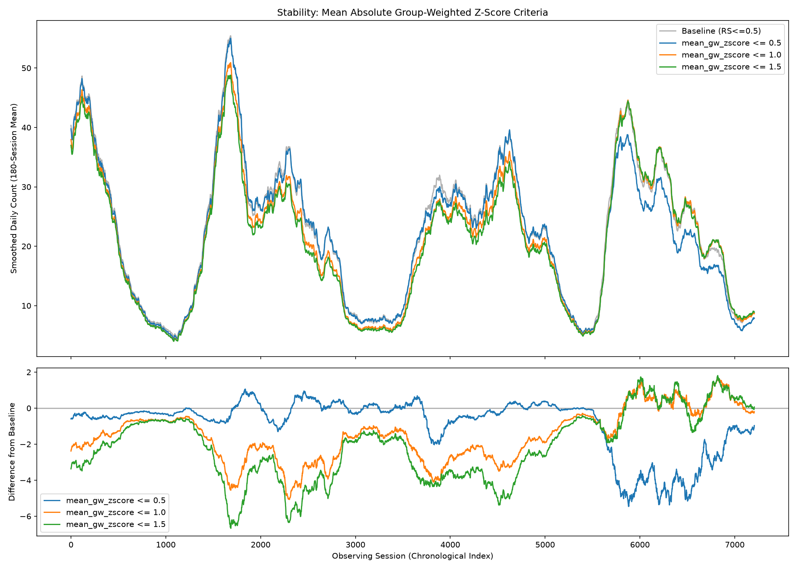
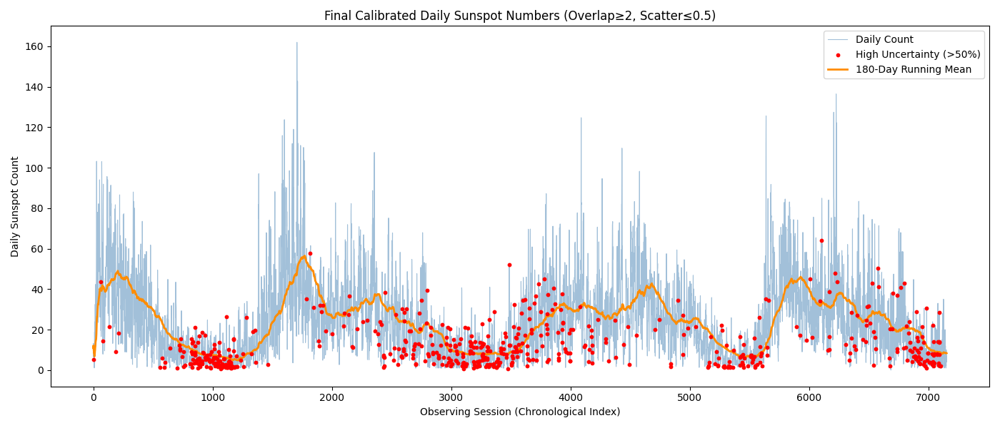
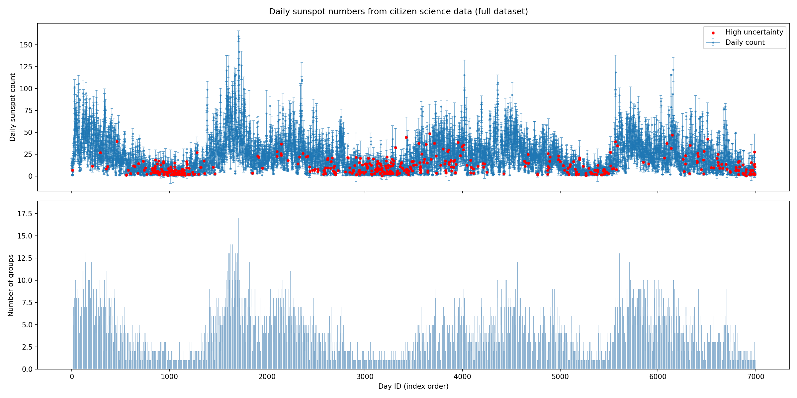

# Reconstruction of Daily Sunspot Numbers from Citizen-Science Image Annotations (MPS Internship)

**Institution:** Max Planck Institute for Solar System Research (MPS), Goettingen  
**Supervisor:** Dr. Natalie Krivova and Dr. Theodosios Chatzistergos  
**Author:** Pragyaan Gaur  

---

## Scientific Background and Motivation

Solar irradiance variability, driven primarily by the emergence and decay of magnetic flux at the solar surface, is one of the key inputs to models of Earth's climate on decadal to centennial timescales. A quantitative record of sunspot activity is therefore central to reconstructing the Sun's radiative output over historical periods. Modern sunspot catalogs are derived from ground-based telescope observations processed by trained professionals. The Sunspot Detectives project takes a complementary approach: it distributes solar image annotation tasks to a large pool of citizen-science volunteers through the Zooniverse platform, where each image is independently classified by multiple participants, and the aggregate counts are compared against those of a vetted expert observer.

The scientific challenge addressed in this work is the conversion of these raw, redundant citizen-science annotations into a calibrated time series of daily sunspot counts that can be compared against professional catalogs and used for downstream irradiance modeling. The problem is nontrivial. Volunteer populations are heterogeneous: participants differ widely in training, consistency, the number of images they annotate, and the systematic tendencies of their counting. The raw data therefore contain inter-observer bias, inconsistent scatter across activity levels, sparse participation on many observing days, and a small fraction of classifications that are statistically incompatible with the consensus. Transforming this noisy, multi-annotator dataset into a scientifically usable signal requires a sequence of methodologically justified decisions about how to measure observer quality, which observers to include, and how to aggregate and propagate uncertainty from the classification level to the daily level.

This repository documents the complete methodology for this transformation. The code, diagnostic outputs, and methodology notes are preserved in four stages of development, each representing a distinct phase of the analysis.

---

## Data Description

The raw dataset is a CSV file of approximately 1 GB containing all volunteer classifications submitted to the Sunspot Detectives Zooniverse project. Each row corresponds to a single annotation event. The columns relevant to this analysis are: a unique classification identifier, the volunteer's registered username or IP address, an `annotations` field encoding the observer's count in a JSON structure, and a `subject_data` field encoding metadata about the solar image, including its filename. The image filename encodes two identifiers: a `day_id` identifying the observing session and a `group_id` identifying the image group within that session.

A critical data engineering challenge encountered early in the analysis is that the `annotations` field is not serialized in a consistent format across the dataset. The field can appear as a top-level integer, a plain string representation of an integer, or a nested list-of-dictionaries structure where the count is stored either under a `value` key or, in a further variant, under a `label` key within the nested list. All four formats are valid annotations and must be handled correctly. An initial parser that treated only the first format silently discarded approximately 225,000 valid classifications, which were recovered by extending the parser to branch on the observed type structure. This is documented in `notebooks/01_early_development.ipynb` and reflects a general principle in large-scale citizen-science data reduction: format heterogeneity often masquerades as missing data and must be diagnosed explicitly rather than assumed to represent data loss.

Volunteer identity is constructed from two fields. Registered Zooniverse users are identified by `user_name`. Anonymous participants are identified by a hashed representation of their IP address, assigned the prefix `anon_`. Rows where neither field is populated are excluded from analysis.

---

## Methodology

### Reference Observer and the Calibration Framework

The calibration framework is built around a single reference volunteer, identified in the dataset as `teolixx`, who has annotated a large number of images across the full observation period. This individual serves as a proxy for ground truth: rather than comparing all volunteers against each other or against an external catalog, each volunteer's counts are evaluated exclusively on those images for which both the volunteer and `teolixx` have submitted a classification. This design isolates each volunteer's quality assessment from the reliability of others and avoids the circularity introduced by consensus-based reference frames.

For the reference observer, the representative count on each image group is taken as the median of all their classifications for that group, which provides robustness against individual annotation errors. Each other volunteer is then compared to this per-group reference on their shared image groups. The pairwise difference between the volunteer's count and the reference count defines the raw residual for each shared observation.

An early iteration of the pipeline introduced a secondary calibration layer: volunteers who did not share images with `teolixx` were evaluated against a consensus baseline constructed from already-accepted primary-calibrated volunteers. This approach was evaluated and rejected. The secondary baseline inherits the combined uncertainty of all contributing volunteers, and the threshold criteria that are appropriate for direct reference comparison are not well-grounded when applied to an indirect consensus. Including secondary-calibrated volunteers would expand the accepted pool at the cost of introducing an unquantified propagated error into the quality assessment. The final pipeline restricts calibration strictly to direct overlap with the reference observer.

### Volunteer Quality Metrics

The per-volunteer statistics computed from the pairwise residuals are the bias and scatter. The bias is the mean of the residuals over all shared image groups and characterizes a volunteer's systematic tendency to count above or below the reference:

$$\mu_{\Delta} = \frac{1}{N} \sum_{i=1}^{N} (x_i - y_i)$$

where $x_i$ is the volunteer's count and $y_i$ is the reference count on the $i$-th shared image group, and $N$ is the number of shared image groups. The scatter is the standard deviation of the residuals and characterizes the volunteer's random inconsistency:

$$S_{abs} = \sqrt{\frac{1}{N} \sum_{i=1}^{N} \left( (x_i - y_i) - \mu_{\Delta} \right)^2}$$

This quantity measures absolute disagreement in units of spot counts, which makes it straightforward to interpret but problematic as a filtering criterion: the natural variability in sunspot counts across the solar cycle means that a scatter of three spots is a minor disagreement during solar maximum and a major one during minimum. A fixed absolute scatter threshold would therefore admit different populations of volunteers depending on the underlying activity level, introducing a solar-cycle-dependent selection bias.

To address this, the primary filtering criterion is the relative scatter, defined as the absolute scatter normalized by the mean reference count over the shared images:

$$S_{rel} = \frac{S_{abs}}{\bar{y}}$$

where $\bar{y}$ is the mean of the reference counts over all shared image groups for that volunteer. This normalization renders the metric dimensionless and approximately activity-level-invariant: a given value of $S_{rel}$ corresponds to the same fractional disagreement regardless of whether the observation was taken during solar maximum or minimum. An empirical check of $S_{rel}$ against $\bar{y}$ across all volunteers (Figure 2) shows that the relative scatter converges and remains stable across the full range of activity levels, supporting this normalization choice.

Two alternative metrics were evaluated in parallel and are documented in `notebooks/02_metric_refinement.ipynb`. Poisson-scaled scatter normalizes by $\sqrt{\bar{y}}$ rather than $\bar{y}$:

$$S_{poisson} = \frac{S_{abs}}{\sqrt{\bar{y}}}$$

This normalization is motivated by the assumption that sunspot counting errors follow Poisson statistics, under which the standard deviation of a count measurement scales as the square root of its expectation. The Poisson-scaled scatter therefore asks whether a volunteer's disagreement is consistent with Poisson noise, and is unity when the volunteer's scatter exactly matches the expected Poisson level. The group-weighted Z-score takes yet another approach, normalizing each individual residual by the empirical standard deviation of all volunteer counts for that specific image group before averaging over shared images:

$$Z_{gw} = \left\langle \left| \frac{x_i - y_i}{\sigma_{\text{group},i}} \right| \rangle$$

where $\sigma_{\text{group},i}$ is the standard deviation of all counts submitted for the $i$-th image group. This metric evaluates a volunteer not against the reference's absolute count but against the difficulty of the image as judged by the full volunteer population: an image with intrinsically difficult morphology will naturally elicit wider disagreement, and a metric that accounts for this provides a fairer comparison across solar conditions.

The stability of the final reconstructed daily time series under each of these four metrics was assessed by running the full pipeline to completion under a range of threshold values for each metric and comparing the resulting 180-session running means against a baseline (Figure 3 through Figure 6). The reconstruction proved insensitive to reasonable variation in threshold values across all four metrics, indicating that the underlying signal is well-determined by any of the candidate quality criteria. Relative scatter was retained as the primary filtering metric on the grounds that it is the simplest well-motivated normalization that produces an interpretable, dimensionless quality score.

### Parameter Selection: Overlap Threshold and Scatter Cutoff

Each volunteer is characterized by two derived quantities: the number of image groups shared with the reference observer ($N$, the overlap count) and the relative scatter $S_{rel}$. A volunteer is admitted to the analysis only if $N \geq N_{\min}$ and $S_{rel} \leq S_{\max}$. The choice of these thresholds involves a trade-off between the statistical reliability of the quality estimate, the strictness of the quality criterion, and the number of accepted volunteers contributing to the final time series.

The overlap threshold $N_{\min}$ controls the minimum number of pairwise comparisons available to estimate a volunteer's relative scatter. At small $N$, the sample estimate of scatter is unreliable: a volunteer may pass the scatter threshold by chance with only one or two shared images. Increasing $N_{\min}$ improves the reliability of the quality estimate at the cost of excluding volunteers whose classification coverage does not overlap extensively with the reference observer. The analysis explored a grid of values $N_{\min} \in \{2, 3, 5, 10, 20\}$ (Figure 1). The correlation between the daily time series produced at $N_{\min} = 5$ and at $N_{\min} = 2$ was measured at 0.97, indicating that relaxing the overlap threshold to $N_{\min} = 2$ substantially increases the number of accepted volunteers without materially altering the reconstructed signal. The final pipeline uses $N_{\min} = 2$.

The scatter cutoff $S_{\max}$ controls the tolerance for random inconsistency. A value of $S_{\max} = 0.5$ means that a volunteer's classification-to-classification scatter, normalized by the reference count, must not exceed 50 percent. The sensitivity of the reconstruction to this threshold was evaluated across $S_{\max} \in \{0.2, 0.3, 0.5, 0.7, 1.0\}$: the 180-session running means produced under these values are visually indistinguishable in the stable interior of the observation period and diverge only marginally at the boundaries where volunteer coverage is sparse. The final pipeline uses $S_{\max} = 0.5$.

  
   <i>Figure 1: Number of accepted volunteers as a function of the minimum overlap threshold (horizontal axis) and the maximum relative scatter threshold (vertical axis). The selected parameter combination is indicated by the red border.</i>

### The Volunteer Population

The 12,323 volunteers who contributed to the dataset exhibit a highly skewed participation distribution. Approximately 61 percent of participants annotated five or fewer images, with a median contribution of three images per participant. A long tail of highly active contributors performs the majority of the classification work: the top 50 volunteers account for approximately 33 percent of all classifications, and 85 volunteers each contributed more than 1,000 annotations.

This structure has a direct implication for the calibration procedure. The quality of a volunteer's scatter estimate scales with their overlap count, and the majority of volunteers provide too few shared images to permit a reliable quality assessment. These volunteers are correctly excluded by the overlap threshold. The scientific signal is carried primarily by the long tail of high-overlap contributors whose statistics are well-constrained.

A representative diagnostic case is the volunteer "WRSunset," who annotated 1,959 image groups in common with the reference observer, placing them among the highest-overlap participants in the dataset. Despite this extensive coverage, the pairwise metric analysis (Figure 7) shows that this volunteer's relative scatter is 0.72, exceeding the 0.5 threshold, and their mean residual indicates a systematic undercounting of approximately 2.7 spots per image. This case illustrates that high participation volume is neither necessary nor sufficient for inclusion in the analysis: the pipeline admits volunteers on the basis of consistency and calibration accuracy, not activity level.

  
   <i>Figure 7: Per-image pairwise error analysis for the volunteer WRSunset, showing absolute, relative, Poisson-scaled, and Huber-loss error as a function of the reference count. This volunteer was rejected by the pipeline due to both excess relative scatter and a systematic negative bias.</i>

  
   <i>Figure 8: Volunteer quality space: relative scatter versus overlap count for all volunteers with at least one shared image. Accepted volunteers (green) satisfy both thresholds; rejected volunteers (red) fail one or both criteria.</i>

### Bias and the Decision to Omit Bias Correction

Each accepted volunteer has a measured bias $\mu_{\Delta}$, which quantifies the extent to which their counts systematically over- or underestimate the reference. An initial version of the pipeline applied a bias correction to accepted volunteers with sufficiently large overlap (specifically, $N \geq 20$), subtracting each volunteer's estimated bias from their individual classifications before aggregation. The motivation was to remove residual systematic drift from the aggregate and prevent it from propagating into the final time series.

Stability testing conducted in Phase 4 showed that the 180-session running mean is not materially altered by the inclusion or removal of this correction. The filtered volunteer pool, by construction, consists of individuals with low scatter relative to the reference count, and for this population the mean bias is close to zero at the aggregate level. The correction is therefore not scientifically necessary for the final time series product, and introduces an additional analysis step with its own dependence on the threshold $N \geq 20$. In the interest of methodological parsimony, bias correction was removed from the final pipeline. The bias of individual accepted volunteers is computed and reported in the output volunteer statistics file and can be consulted if a future analysis requires per-volunteer corrections.

### Within-Group Outlier Rejection

Even among accepted volunteers, individual classifications may diverge from the group consensus in a given image group due to momentary inattention, misinterpretation of image features, or rare annotation errors. These classifications are not captured by the inter-observer quality metrics, which are computed at the volunteer level rather than the classification level, and can distort the group mean if not addressed.

To handle this, each individual classification within a given image group is converted to a standardized residual (Z-score) relative to the group mean:

$$Z_{ij} = \frac{x_{ij} - \bar{x}_j}{\sigma_j}$$

where $x_{ij}$ is the count submitted by volunteer $i$ for image group $j$, and $\bar{x}_j$ and $\sigma_j$ are the mean and standard deviation of all accepted-volunteer counts for that group. Classifications with $|Z_{ij}| > 2.5$ are rejected. For image groups where all volunteers agree exactly, $\sigma_j = 0$ and no outlier rejection is applied.

The Z-score threshold of 2.5 was selected by examining the empirical distribution of Z-scores across all image groups and comparing it to a standard normal distribution (Figure 9). The bulk of the distribution is consistent with Gaussian scatter, and the threshold at $\pm 2.5$ falls well into the tails, excluding only classifications that are incompatible with the group consensus under reasonable assumptions about the noise structure. This plot also serves as a retrospective validation: the approximate normality of the inter-volunteer deviation distribution among accepted observers supports the assumption that volunteer counts for a given image can be treated as independent draws from a distribution whose mean is close to the true count.

  
   <i>Figure 9: Empirical distribution of within-group Z-scores for all accepted classifications (blue histogram) compared against the standard normal distribution (black curve). The symmetric cutoff at |Z| = 2.5 is marked in red.</i>

### Aggregation and Uncertainty Propagation

After outlier rejection, the daily sunspot count is assembled through a two-level aggregation. At the first level, the surviving classifications for each image group are averaged to produce a per-group count. At the second level, the per-group counts for all image groups assigned to a given observing day are summed to produce the daily total. This two-level structure reflects the organization of the Zooniverse dataset, in which multiple image groups may be observed on the same day. The sum over groups is the natural estimate of the total sunspot count for that day.

Uncertainty is propagated from the group level to the daily level by treating the per-group standard deviation as an estimate of the group-level error and summing in quadrature across groups for a given day:

$$\sigma_{\text{day}} = \sqrt{\sum_j \sigma_j^2}$$

This propagation assumes independence between image groups within a day, which is approximately satisfied since different groups correspond to different images or solar regions. The resulting daily uncertainty is reported alongside the daily count in the output file.

A note on an earlier diagnostic feature: an initial version of the analysis flagged days with high fractional uncertainty ($\sigma_{\text{day}} / N_{\text{day}} > 0.5$) as "high-uncertainty" and marked them distinctly in time-series plots. Inspection of these flags showed that they cluster overwhelmingly during periods of solar minimum, when the total daily count is small. The fractional uncertainty is mathematically sensitive to small denominators: a disagreement of one or two spots on a day with three total spots produces a much larger fractional error than the same disagreement on a day with thirty total spots. These flags therefore trace solar activity level rather than genuine data quality degradation. The flag was removed from the final pipeline, and the raw uncertainty values are retained in the output for users to apply their own thresholds if required.

### Stability of the Reconstructed Signal

The stability of the final daily time series across a range of pipeline parameter choices is the primary validation criterion for the methodology. Stability tests were conducted by varying the four candidate quality metrics and their threshold values independently, running the full pipeline to completion under each configuration, computing a 180-session running mean to suppress daily noise, and overlaying the results (Figures 3 through 6). The 180-session window was chosen to correspond approximately to the timescale of a solar rotation period multiplied by a factor sufficient to smooth stochastic session-to-session variation, enabling long-term trends to be assessed visually.

  
   <i>Figure 3: Stability of the 180-session running mean daily count under three relative scatter thresholds. The upper panel shows the absolute time series for each configuration; the lower panel shows the difference from the baseline reconstruction (S_rel &lt;= 0.5). The signal is stable across the tested range.</i>

  
   <i>Figure 4: Stability of the reconstruction under three absolute scatter thresholds.</i>

  
   <i>Figure 5: Stability of the reconstruction under three Poisson-scaled scatter thresholds.</i>

  
   <i>Figure 6: Stability of the reconstruction under three group-weighted Z-score thresholds.</i>

---

## Final Reconstructed Time Series

The final pipeline (`src/final_pipeline.py`) implements the methodology described above as a single sequential script. Running the script produces the daily sunspot time series, the per-group aggregation, the accepted volunteer statistics, and a set of diagnostic plots for all major pipeline decisions.

  
   <i>Figure 10: Final reconstructed daily sunspot count (blue, semi-transparent) and 180-session running mean (orange). The horizontal axis indexes observing sessions in chronological order; actual dates are not available in the present dataset and have not been assigned.</i>

An earlier version of the time series, produced before secondary calibration was removed and before the updated JSON parser was deployed, is shown in Figure 11 for comparison.

  
   <i>Figure 11: Time series from an earlier pipeline iteration, included for comparison.</i>

---

## Scope and Limitations

This pipeline reconstructs daily sunspot counts from citizen-science annotations and propagates uncertainty from the classification level to the daily level. Several limitations should be understood before using these data in downstream scientific analysis.

The temporal axis is indexed by the `day_id` field parsed from image filenames, which provides a chronological ordering of observing sessions but does not correspond to absolute calendar dates in the current implementation. Cross-referencing the `day_id` index against an external calendar of solar observations would be required before the time series could be compared against professional sunspot catalogs or used in climate model inputs.

The calibration framework depends entirely on the availability of a reliable reference observer. If the reference observer's classifications contain systematic errors not captured in the pairwise comparison, those errors will propagate undetected into the accepted volunteer pool and the final time series. The quality of the reference observer is assumed but not independently validated within this pipeline.

Volunteer overlap with the reference observer is a prerequisite for inclusion, and the final time series is constructed from a subset of the full volunteer pool whose classifications happen to have been submitted for image groups also annotated by the reference observer. On observing days with sparse reference coverage, the number of calibrated volunteers contributing to the daily count may be small, increasing sampling uncertainty beyond what the formal propagated error captures.

The within-group Z-score outlier rejection assumes approximate normality of the volunteer count distribution for a given image group. This assumption holds reasonably well for groups with many contributors but is not testable for image groups with very few accepted volunteers. Additionally, the Z-score is undefined for groups with zero variance across volunteers, and these groups are passed through without outlier filtering.

The final daily count is a sum of per-group means, not a direct count of sunspots from a single image. It should be interpreted as a statistical estimate of the daily sunspot number, with uncertainty as propagated, rather than as a direct observational measurement.

---

## Repository Structure

The following files and directories constitute the full methodological record.

- `src/final_pipeline.py`: The definitive analysis script implementing the five-step methodology described above: data ingestion and parsing, reference calibration, parameter sensitivity analysis, within-group outlier rejection, and daily aggregation. This script is self-contained and reproduces the final time series and all primary diagnostic plots when run against the raw dataset.

- `notebooks/01_early_development.ipynb`: A record of the Phase 1 and Phase 2 analysis, including the initial sample-dataset pipeline, the successive full-dataset implementations, and the discovery and resolution of the JSON format bifurcation that caused approximately 225,000 valid classifications to be silently excluded by the initial parser.

- `notebooks/02_metric_refinement.ipynb`: A record of the Phase 3 and Phase 4 analysis, including the evaluation of the secondary calibration hypothesis, the investigation of anomalous volunteers including the WRSunset case, the exploration of alternative quality metrics, and the stability analysis that justified the final parameter choices and the removal of bias correction.

- `Assets/`: All diagnostic plots generated during the analysis, including per-volunteer pairwise metric plots, the quality space scatter plots, parameter sensitivity heatmaps, metric stability plots, and the final time series. Text-format console outputs from early pipeline iterations are also preserved here for reference.
